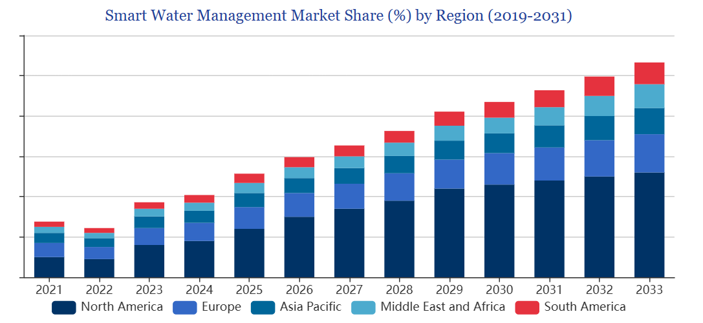

```{r logo, echo=FALSE, out.width = '20%', out.height= '20%', fig.align = "center"}
library(knitr)
include_graphics("images/Logo_ISARA.png")
```
\newpage


# Introduction

L'eau est indispensable pour la vie - animale et végétale- sur terre,c'est donc une ressource qui fait partie de notre vie quotidienne. La ressource en eau est très inégalement reparti sur la planète et recouvre environs 70 % de la surface de la terre atteignant un volume de 1350 milliards de m3. L'eau douce étant consommable dircetement représente juste 0,7 %. La repartition inégale de l'eau sur terre fait d'elle une ressource prisé et peut parfois être source de conflit entre états. 2 milliards de personnes dans le monde n'ont pas accès à une eau de qualité.[@dal_pont_leau_2024]
D'ici 2050, jusqu'a deux tiers de la population mondiale pourraient vivre dans des zones où l'accès aux ressources en eau douce est limité [statista]. La gestion intégrée de l'eau est donc premordial pour la rendre accessible pour tous. Une gestion intégrée des ressources en eau doit donc être mis en place par chaque états afin de garantir l'accès en quantité et en qualité aux populations. Néamoins, la population grandissante et les changement climatiques compliquent cette tâche. Les
Les évolutions dans le domain du numérique apportent de nouvelles perpectives à la gestion de l'eau. La gestion intelligente va permettre de réduire les coûts opératoires, d’améliorer la durabilité des opérations, d’optimiser la gestion patrimoniale et d’offrir de nouveaux services aux usagers. Les projections 2017-2026 sur le marché de la gestion intelligente des réseaux indiquent un taux de croissance mondiale moyen de 20 %, ce qui représente 50 milliards de dollars sur les 10 années. [@dal_pont_enjeux_2024]
Pour atteindre l'objectif de développement durable 6 (ODD 6) qui vise à assurer la disponibilité et la gestion durable de l'eau et de l'assainissement pour tous d'ici 2030, le numérique est indispensable.

# La gestion intelligente de l'eau

## Définition

La gestion intelligente de l'eau vise à orienter l'utilisation de l'eau de manière à favoriser l'efficacité, la suffisance et la durabilité. Pour atteindre cet objectif, les approches contemporaines de la gestion s'appuient sur l'intégration de technologies innovantes, telles que les capteurs, les compteurs d'eau intelligents, les systèmes d'information, l'acquisition de données et les systèmes d'aide à la décision. [@jenny_bable_2020]

## Les technologies clés dans la gestion intélligente de l'eau

### Le Système d'information géographique (SIG) et La télédétection

La La télédétection fournit depuis plus d’une cinquantaine d’années des informations spatio-temporelles à différentes échelles pour caractériser les sols nus et les cultures. Ces informations sont téléchargeables gratuitement et offrent un catalogue d’images de satellites variés et de cartes thématiques dérivées de ces observations. L'agriculture étant une des plus grosse consommatrice d'eau, la télédétection offre pleins d'informations qui peuvent être dérivées des images satellitaires, comme des cartes d’occupation des sols, d’humidité, qui sont de plus en plus accessibles via des plateformes ouvertes au grand public. Ces informations peuvent ensuite être cartographiées et permettre ainsi de localiser et visualiser les résaux d'eau et des équipements. Tous ceci facilite la gestion et la planification grâce aux avancé technologiques notamment dans le numérique. [@fao_teledetection_1995]

### Les capteurs et compteurs intelligents

Un capteur est un équipement qui pemet de mesurer une quantité physique et la traduit en un signal.La quantité en question peut être par exemple la température la pression ou une hauteure [@hbk_france_definition_2022]. Les compteurs intelligents sont des appareils numériques qui ont un système de mesure intégré conçu pour mesurer avec précision la consommation d’énergie à l’aide de la technologie numérique.Ils remplacent progressivement les compteurs traditionnels et fonctionne à l'aide de la des capteurs [@ibm_quest-ce_2024].

### Internet des objets (IoT)

L'Internet des objets (IoT) est un réseau d'objets et de terminaux connectés équipés de capteurs et d'autres technologies leur permettant de transmettre et de recevoir des données entre eux et avec d'autres systèmes. Aujourd'hui, l'IoT est utilisé de manière intensive dans l'industrie notamment dans le domaine de la production et distribution de l'eau potable. Après la collecte et la transmission des données, le maximum d'information est recueillit et les resultats extraits. Les IA sont très utiles pour l'analyse des données et complètent ainsi les IoT. [@jenny_bable_2020]

### Intelligence artificielle (IA)

L’intelligence artificielle c'est tout outil utilisé par une machine capable de reproduire des comportements liés aux humains, tels que le raisonnement, la planification et la créativité. En France l'IA occupe une place importante et fait partie de la stratégie nationale. Ceci est visible à travers les objectifs de la stratégie nationale pour l'intelligence artificielle lancée en 2018 qui sont de donner un sens à l'IA et de faire de la France un champion mondial de l'IA. [@enseignement_superieur_intelligence_2024]

# La marché de la gestion intélligente de l'eau

Le marché mondial de la gestion de l'eau ne cesse de croître et devrait atteindre les 3.07 milliards d'ici 2026. L'Allemagne est le leadeur européen en ce qui concerne l'exportation des tecnologies de l'eau [@jenny_bable_2020].

```{r, echo=FALSE, out.width = '100%', fig.align = "center", fig.cap="Parts du marché de la gestion de l'eau",}

```

# Perspectives d'avenir

## Essor des technologies de pointe

L'intelligence artificielle, l'apprentissage automatique et l'analyse prédictive joueront un rôle de plus en plus important dans l'optimisation de la gestion de l'eau. Ces technologies permettront une meilleure prévision des besoins en eau, une détection plus rapide des fuites et une gestion plus efficace des ressources.

## Intégration des données

L'interopérabilité des systèmes et la capacité à intégrer des données provenant de sources diverses (capteurs, satellites, modèles hydrologiques) seront essentielles pour une gestion intégrée et adaptative.

## Solutions personnalisées

Les solutions de gestion intelligente de l'eau deviendront plus personnalisées et adaptées aux besoins spécifiques des différentes régions et des différents secteurs (agriculture, industrie, villes).

## Participation accrue des citoyens

Les applications mobiles et les plateformes de visualisation des données permettront aux citoyens de mieux comprendre leur consommation d'eau et de participer activement à la gestion de cette ressource.

## Investissements massifs

Les investissements dans les infrastructures intelligentes de l'eau augmenteront considérablement, stimulés par la nécessité de faire face aux défis croissants liés à la pénurie d'eau et au changement climatique.

## Réglementations plus strictes

Les gouvernements mettront en place des réglementations plus strictes pour encourager l'adoption de solutions de gestion intelligente de l'eau et pour garantir une utilisation durable de cette ressource.

# Conclusion

La gestion intelligente de l'eau représente une solution incontournable pour relever les défis croissants liés à la pénurie d'eau et au changement climatique. En combinant les technologies numériques, la gestion intégrée des ressources en eau et la participation active des citoyens, il est possible d'assurer une utilisation durable et équitable de cette ressource vitale. L'atteinte de l'objectif de développement durable 6 (ODD 6) d'ici 2030 dépendra en grande partie de la capacité des États et des entreprises à adopter et à mettre en œuvre des solutions de gestion intelligente de l'eau à grande échelle. Le marché en pleine croissance de la gestion intelligente de l'eau témoigne du potentiel énorme de ces technologies pour transformer la façon dont nous gérons cette ressource essentielle.
\newpage

# Bibliographie

