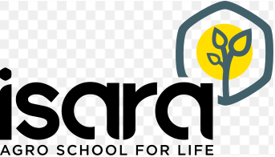

```{r logo, echo=FALSE, out.width = '10%', out.height= '5%', fig.align = "center"}
library(knitr)

```

# Introduction

L'eau est indispensable pour la vie - vie animale et végétale- sur terre,c'est donc une ressource qui fait partie de notre vie quotidienne. La ressource en eau est très inégalement reparti sur la planète et recouvre environs 70 % de la surface de la terre atteignant un volume de 1350 milliards de m3. L'eau douce étant consommable dircetement représente juste 0,7 %. La repartition inégale de l'eau sur terre fait d'elle une ressource prisé et peut parfois être source de conflit entre états. 2 milliards de personnes dans le monde n'ont pas accès à une eau de qualité.[enjeux]
D'ici 2050, jusqu'a deux tiers de la population mondiale pourraient vivre dans des zones où l'accès aux ressources en eau douce est limité [statista]. La gestion intégrée de l'eau est donc premordial pour la rendre accessible pour tous. Une gestion intégrée des ressources en eau doit donc être mis en place par chaque états afin de garantir l'accès en quantité et en qualité aux populations. Néamoins, la population grandissante et les changement climatiques compliquent cette tâche. Les
Les évolutions dans le domain du numérique apportent de nouvelles perpectives à la gestion de l'eau. La gestion intelligente va permettre de réduire les coûts opératoires, d’améliorer la durabilité des opérations, d’optimiser la gestion patrimoniale et d’offrir de nouveaux services aux usagers. Les projections 2017-2026 sur le marché de la gestion intelligente des réseaux indiquent un taux de croissance mondiale moyen de 20 %, ce qui représente 50 milliards de dollars sur les 10 années. [Enjeu num]
Pour atteindre l'objectif de développement durable 6 (ODD 6) qui vise à assurer la disponibilité et la gestion durable de l'eau et de l'assainissement pour tous d'ici 2030, le numérique est indispensable.

# La gestion intélligente de l'eau

## Définition

La gestion intelligente de l'eau vise à orienter l'utilisation de l'eau de manière à favoriser l'efficacité, la suffisance et la durabilité. Pour atteindre cet objectif, les approches contemporaines de la gestion s'appuient sur l'intégration de technologies innovantes, telles que les capteurs, les compteurs d'eau intelligents, les systèmes d'information, l'acquisition de données et les systèmes d'aide à la décision. [Bable]

## Les technologies clés dans la gestion intélligente de l'eau

### Le Système d'information géographique (SIG) et La télédétection

La La télédétection fournit depuis plus d’une cinquantaine d’années des informations spatio-temporelles à différentes échelles pour caractériser les sols nus et les cultures. Ces informations sont téléchargeables gratuitement et offrent un catalogue d’images de satellites variés et de cartes thématiques dérivées de ces observations. L'agriculture étant une des plus grosse consommatrice d'eau, la télédétection offre pleins d'informations qui peuvent être dérivées des images satellitaires, comme des cartes d’occupation des sols, d’humidité, qui sont de plus en plus accessibles via des plateformes ouvertes au grand public. Ces informations peuvent ensuite être cartographiées et permettre ainsi de localiser et visualiser les résaux d'eau et des équipements. Tous ceci facilite la gestion et la planification grâce aux avancé technologiques notamment dans le numérique. [télédétection]

### Les capteurs et compteurs intélligents

### Internet des objets (IoT)

### Intelligence artificielle (IA)

### Surveillance de la qualité de l'eau

# La marché de la gestion intélligente de l'eau

# Perspectives d'avenir

# Conclusion

# Bibliographie

